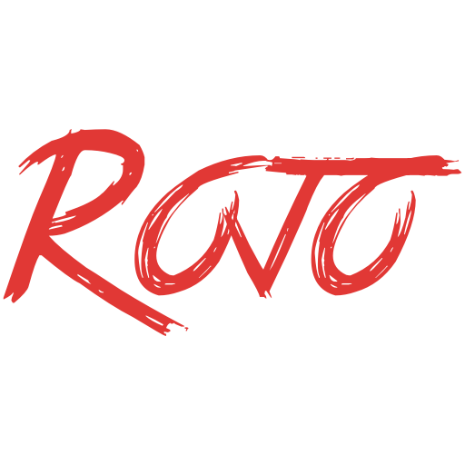

# Rojo Branding
This repository contains all of the source images for Rojo's branding, as well as recommended renders into formats like PNG. It's isolated from the [main Rojo repository](https://github.com/rojo-rbx/rojo) to avoid extra bloat, since everything here is a binary blob!

"Rojo Red" is currently `#e13835`. This color was chosen to look good on dark and light backgrounds.

## Contents

### Logo (`png/logo-512.png`)
Created from `krita/logo.kra`.

<kbd></kbd>

### Square Logo (`png/logo-square-512.png`)
Created from `krita/logo-square.kra`.

<kbd></kbd>

This image is also available with a white background at `png/logo-plugin-512.png`.

### Rojo "R" (`png/r-logo-square-32.png`)
Created from `krita/r-logo-square.kra`.

<kbd></kbd>

## License
Rojo is available under the terms of the Mozilla Public License, Version 2.

Details are available in [LICENSE.txt](LICENSE.txt) or [https://opensource.org/licenses/MPL-2.0](https://opensource.org/licenses/MPL-2.0).